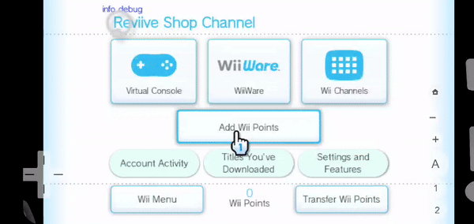

<h1 align="center">🎮🏪 Reviive Shop Channel</h1> 

<h2 align="center">Reviive Shop Channel is.. </h2>
<code>a project driven by the community with the aim of bringing back the same experience of the Wii Shop Channel for the Wii. Remember when you could download channels, WiiWare and Virtual Console titles? Or maybe you never experienced that? Well, with Reviive Shop Channel you can experience it again! Reviive Shop Channel can run on any Wii console, it's region-free and also works on Wii U via Wii Mode. Reviive Shop Channel provides WiiWare, Virtual Consoles and Wii Channels.

Reviive Shop Channel is a community-driven project, which means it relies on the support and contributions of dedicated fans and developers. It's availability could change. Please stay connected to the community channels for any updates, assistance, and announcements regarding the revival by checking us on one of our social medias below.</code>

# **Who works on Reviive?**
 
Developers:   [**Wabagg123, Thom, Alex, RandomName, fin, MattTheTekie.**] 
Graphic Designers:   [**fin, ChrisPlayzYT**]
 Translators:   [**RandomName, Alex, Thom**] 
The website is **hosted and developed by fin**, while the **Wii Shop Channel development** is **led by Thom and Wabagg123.** 

**[Features]** 
Daft Punk themed!
Easy to use.
Lightweight.
Includes loads of tools, and utilities. 

**[Download today!]**
https://ftolnks.xyz/faq/ 

 
 
